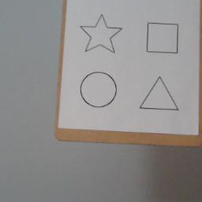
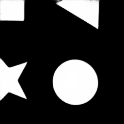

# Image-Segmentaion

  *input images*

 
 *Ground Truth*

 *Predicted Output*

Note: The code and all data files are taekn from [@seth814](https://github.com/seth814). Credit goes to him. I changed code files to work on CPU and interpreted to input a single frame to perform semantic segmentation.
