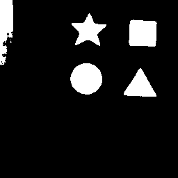

# Image-Segmentaion
<figure>
  
<figcaption>Fig.2 input images</figcaption>

  
<figcaption>Fig.2 Ground Truth</figcaption>

  
<figcaption>Fig.3 Predicted Output</figcaption>
</figure>

## Train
Before training, model configuration  can be set in `config.py` file. After that open conda enviroemnt and change directory to project folder. Run `python train.py` to start training process. I trained this model for binary class segmentation using U-Net. Due to unavailability of GPU, it took 16 hours to train a model on CPU :blush:.

## Inference
* Open `stream_c.py` and locate yourself at `cv2.imread()` where you need to manually enter path of image that you want to input the model.

* Activate conda enviroment and run `stream_c.py`. I am not good at naming files, you can change if you want.

### Credits
Code and datset are taken from [@seth814](https://github.com/seth814). I modifed code files to work on CPU and interpret a input image rather stream of video, to perform semantic segmentation.
